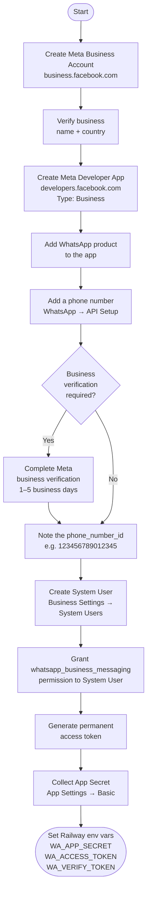
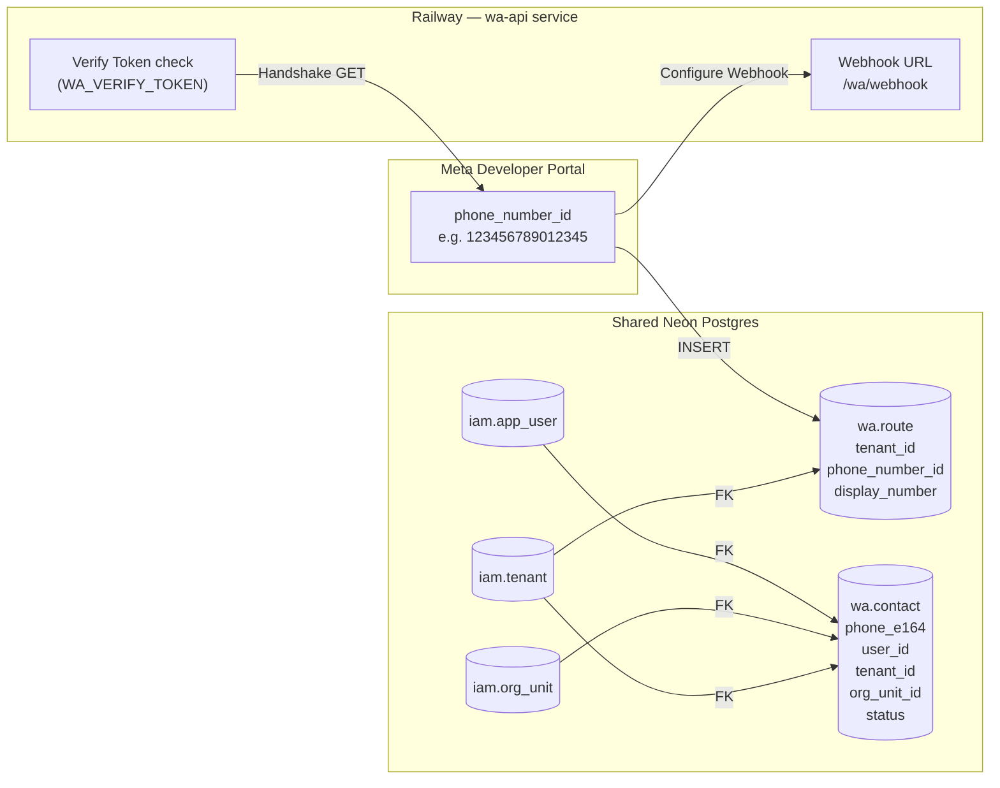
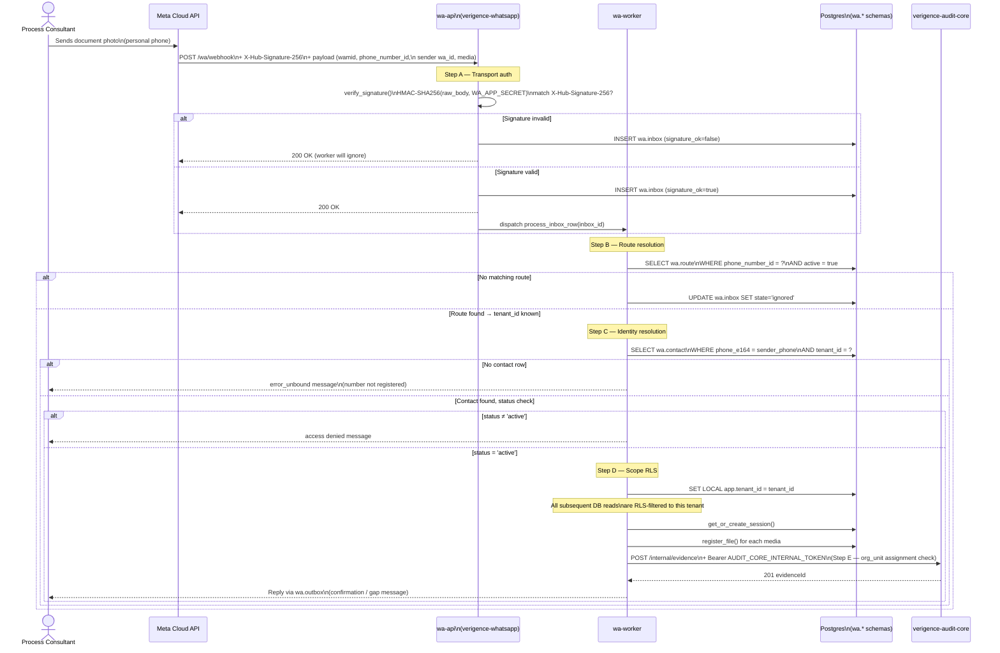
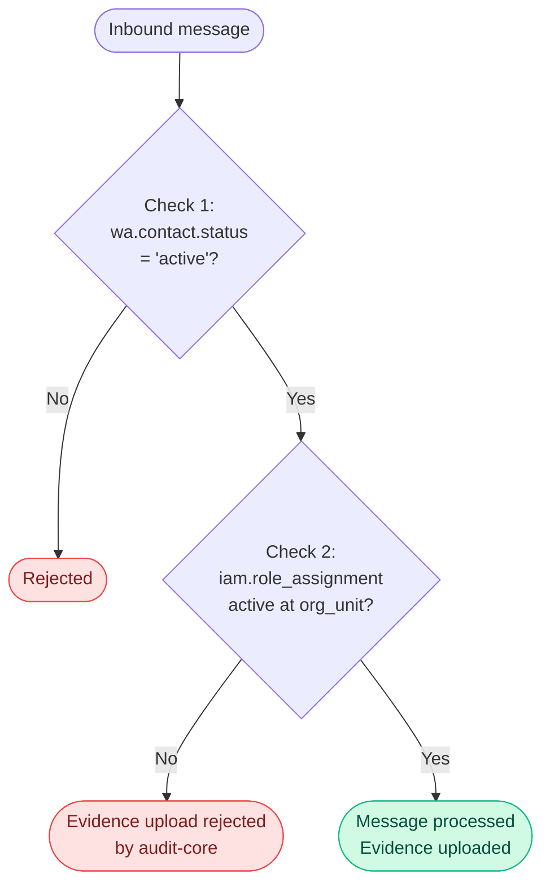

# WhatsApp Account Setup & User Authentication

This document covers:
1. How to set up a WhatsApp Business Account with Meta
2. How the business number is integrated with the Verigence WhatsApp service
3. How a Process Consultant is authenticated when they send a message

---

## 1. Meta WhatsApp Business Account Setup

This is a one-time admin task. The outcome is three credentials that go into Railway environment variables.



### What you collect from Meta

| Credential | Where to find it | Railway env var |
|---|---|---|
| **App Secret** | App Settings → Basic → App Secret | `WA_APP_SECRET` |
| **System User Token** | Business Settings → System Users → Generate Token | `WA_ACCESS_TOKEN` |
| **Phone Number ID** | WhatsApp → API Setup (15-digit numeric ID) | inserted into `wa.route` table |
| **Verify Token** | You choose any secret string | `WA_VERIFY_TOKEN` |

---

## 2. Integrating the Business Number with the Verigence Service

After Meta setup, two SQL inserts activate the integration. These are admin operations, not code changes.



### Step 1 — Register the WhatsApp number for a tenant

```sql
INSERT INTO wa.route (tenant_id, phone_number_id, display_number)
VALUES (
    'a1b2c3d4-...',       -- UUID from iam.tenant
    '123456789012345',    -- phone_number_id from Meta Developer Portal
    '+91 98765 43210'     -- human-readable number
);
```

If no `wa.route` row exists for the incoming `phone_number_id`, every webhook from that number is silently ignored.

### Step 2 — Configure the Meta webhook

In Meta Developer Portal → App → WhatsApp → Configuration:
- **Callback URL**: `https://<wa-api-railway-url>/wa/webhook`
- **Verify Token**: value of `WA_VERIFY_TOKEN`
- **Subscribed fields**: `messages`

Meta calls `GET /wa/webhook?hub.mode=subscribe&hub.verify_token=...&hub.challenge=...` — the service responds with the challenge string to confirm ownership.

### Step 3 — Bind each Process Consultant's phone number

```sql
INSERT INTO wa.contact (
    phone_e164,        -- PC's personal WhatsApp number e.g. '+919876543210'
    user_id,           -- UUID from iam.app_user (their Verigence login)
    tenant_id,         -- must match the wa.route tenant_id
    org_unit_id,       -- the Dealer/Outlet the PC is assigned to
    status,            -- 'active' to allow submissions
    locale             -- 'en', 'hi', or 'pa'
)
VALUES (
    '+919876543210',
    'u1u2u3u4-...',
    'a1b2c3d4-...',
    'd1d2d3d4-...',
    'active',
    'hi'
);
```

This is the **binding** between a WhatsApp phone number and a Verigence user identity. Without this row the PC's messages are rejected.

---

## 3. How a User is Authenticated

There is no login prompt, no password, no token typed by the PC. **WhatsApp itself is the authentication factor.** The PC's personal phone number — already verified by Meta at SIM level — is pre-bound to their Verigence user account by an admin.

### Authentication chain (step by step)



### The five authentication steps in plain English

| Step | What is checked | Where | Failure action |
|------|----------------|-------|---------------|
| **A** Transport | HMAC-SHA256 of webhook body matches Meta's signature | `wa/webhook.py` `verify_signature()` | Row recorded as `signature_ok=false`, worker ignores it |
| **B** Route | `phone_number_id` in payload matches a row in `wa.route` with `active=true` | `wa/router.py` `resolve_route()` | Message silently dropped (unknown number) |
| **C** Identity | Sender's `+E.164` phone matches a `wa.contact` row scoped to the resolved tenant | `wa/router.py` `resolve_contact()` | PC receives `error_unbound` message |
| **C'** Status | `wa.contact.status = 'active'` | `wa/router.py` `resolve_contact()` | PC's message rejected |
| **D** RLS scope | `SET LOCAL app.tenant_id` set immediately after resolution | `wa/router.py` `resolve_full_context()` | All subsequent queries auto-scoped; cross-tenant reads return zero rows |
| **E** Org-unit | PC has active role assignment at the outlet in `iam.role_assignment` | `verigence-audit-core` `/internal/evidence` | Evidence upload rejected with 403 |

### Two-dimensional authorization (Design Decision D-01)

Per the solution design (VAC-WA-SD-001 §8.1), **both** of these must hold simultaneously:



This means:
- Removing a PC's Dealer/Outlet assignment in Audit Core **immediately** prevents further evidence uploads — the `wa.contact` row can still exist.
- Suspending a `wa.contact` row **immediately** blocks the PC's next inbound message, before evidence upload is even attempted.

### Revocation reference

| Action | Effect | Immediacy |
|--------|--------|----------|
| `UPDATE wa.contact SET status = 'suspended'` | Next message ignored | Immediate (next inbound) |
| `UPDATE wa.contact SET status = 'revoked'` | Permanent block | Immediate |
| `UPDATE wa.route SET active = false` | Entire number goes dark; all PCs on that number blocked | Immediate |
| Delete role assignment in Audit Core | Evidence upload rejected even if contact is active | Immediate |
| Revoke `WA_ACCESS_TOKEN` in Meta | Service can no longer send outbound messages | Immediate |

---

## 4. Full end-to-end flow diagram

```mermaid
flowchart TD
    subgraph PC ["Process Consultant (field)"] 
        P1([Sends documents\nvia personal WhatsApp])
    end

    subgraph Meta ["Meta Cloud API"]
        M1[Delivers webhook\nPOST /wa/webhook\n+ HMAC signature]
        M2[Delivers / receives\nmedia + messages]
    end

    subgraph WA_API ["wa-api (Railway)"]
        W1["A. verify_signature()\n→ HMAC-SHA256"]
        W2["INSERT wa.inbox"]
        W3["dispatch Procrastinate task"]
    end

    subgraph WA_Worker ["wa-worker (Railway)"]
        direction TB
        WK1["B. resolve_route()\nphone_number_id → tenant"]
        WK2["C. resolve_contact()\nphone_e164 + tenant → user"]
        WK3["D. SET LOCAL app.tenant_id\n(RLS engaged)"]
        WK4["get_or_create_session()\n90s debounce timer"]
        WK5["fetch_media() — streaming\nSHA-256, ≤4 attempts"]
        WK6["redact() — Aadhaar masking\n(if WA_REDACTION_ENABLED=true)"]
        WK7["store_via_audit_core()\nHTTP POST /internal/evidence"]
        WK8["find/create deal\n(cold-start + fuzzy dedup)"]
        WK9["enqueue gap message\nvia wa.outbox"]
    end

    subgraph AuditCore ["verigence-audit-core (Railway)"]
        AC1["E. bearer token check\nAUDIT_CORE_INTERNAL_TOKEN"]
        AC2["F. org_unit assignment\ncheck (iam.role_assignment)"]
        AC3["Evidence Service\n→ DI pipeline"]
    end

    subgraph DB ["Shared Neon Postgres"]
        DB1[(wa.inbox\nno RLS)]
        DB2[(wa.contact\nno RLS)]
        DB3[(wa.route)]
        DB4[(wa.session\nRLS)]
        DB5[(wa.file\nRLS)]
        DB6[(doc.deal\nRLS)]
    end

    P1 -->|WhatsApp| M1
    M1 --> W1
    W1 --> W2
    W2 --> DB1
    W2 --> W3
    W3 --> WK1
    WK1 --> DB3
    WK1 --> WK2
    WK2 --> DB2
    WK2 --> WK3
    WK3 --> WK4
    WK4 --> DB4
    WK4 --> WK5
    WK5 -->|media download| M2
    WK5 --> WK6
    WK6 --> WK7
    WK7 --> AC1
    AC1 --> AC2
    AC2 --> AC3
    WK7 --> DB5
    WK4 --> WK8
    WK8 --> DB6
    WK8 --> WK9
    WK9 -->|reply| M2
    M2 -->|WhatsApp| P1
```

---

## 5. What WhatsApp setup does NOT do

| Misconception | Reality |
|---|---|
| WhatsApp is a permission system | WhatsApp proves phone ownership only. Verigence authorization lives in `wa.contact` (binding) and `iam.role_assignment` (outlet scope). |
| Any phone can send documents | Only phones with an active `wa.contact` row scoped to the tenant's `wa.route` are processed. All others are silently ignored. |
| The PC logs in via WhatsApp | There is no login. The pre-registered phone-to-user binding IS the identity assertion. |
| Removing a user from Verigence is enough | You must also set `wa.contact.status = 'revoked'` or the phone binding persists (even though evidence upload will fail). Best practice: do both atomically. |

---

*See also: [`README.md`](../README.md) · [`src/wa_service/wa/router.py`](../src/wa_service/wa/router.py) · [`migrations/001_wa_schema.sql`](../migrations/001_wa_schema.sql)*
